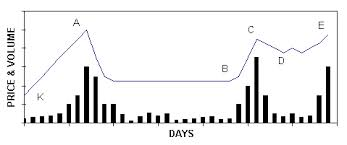

# canslimTechnical

## Stock pattern recognition of cup and handle patterns

This project is used to implement various stock pattern recognition
mechanisms.  Focus is on implementing algorithms to identify the cup
and handle pattern as popularised by William O' Neil in his CANSLIM
approach to stock picking.

The codes are based on the following papers:

1. http://web.mit.edu/people/wangj/pap/LoMamayskyWang00.pdf
2. ftp://80.240.216.180/Transmission/%D0%A4%D0%B0%D0%B9%D0%BB%D1%8B/S&C%20on%20DVD%2011.26/VOLUMES/V16/C10/077CUP.pdf

### Rules for cup and handle patterns

Bandwidth for kernel regression = 3.

#### Between points K and A
1. p.a > 30, p.a >= 1.15*p.k
2. uprv1/dprv1 > 1

#### Between points A and B
1. p.b < 0.85*p.a, p.b >= 0.65*p.a
2. avg.vol < avg.ma.vol
3. Length of left side of cup 20 to 60 days

#### Between points B and C
1. p.c > 0.6*p.a + 0.4*p.b & p.c <= p.a
2. uprv2/dprv2 > 1
3. Length of right side of cup 3 to 30 days

#### Between points C and D
1. p.d <= p.c
2. uprv2/dprv3 > 1
3. Length of right side of cup 3 to 20 days

